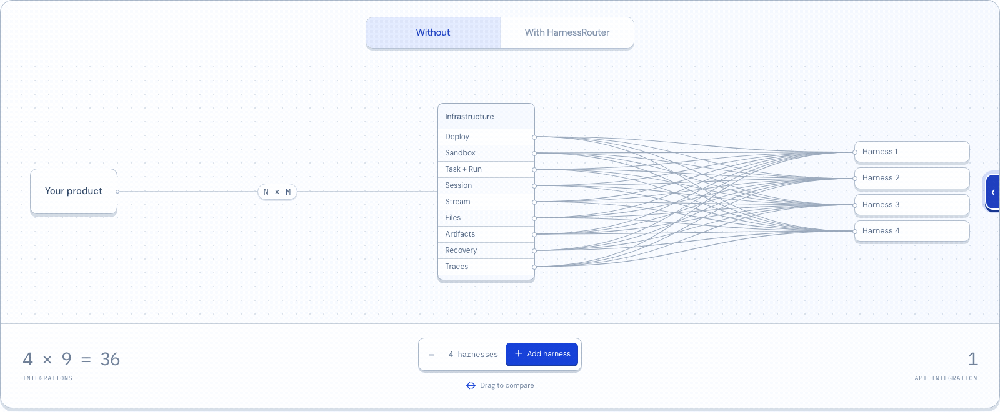
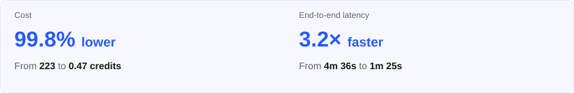
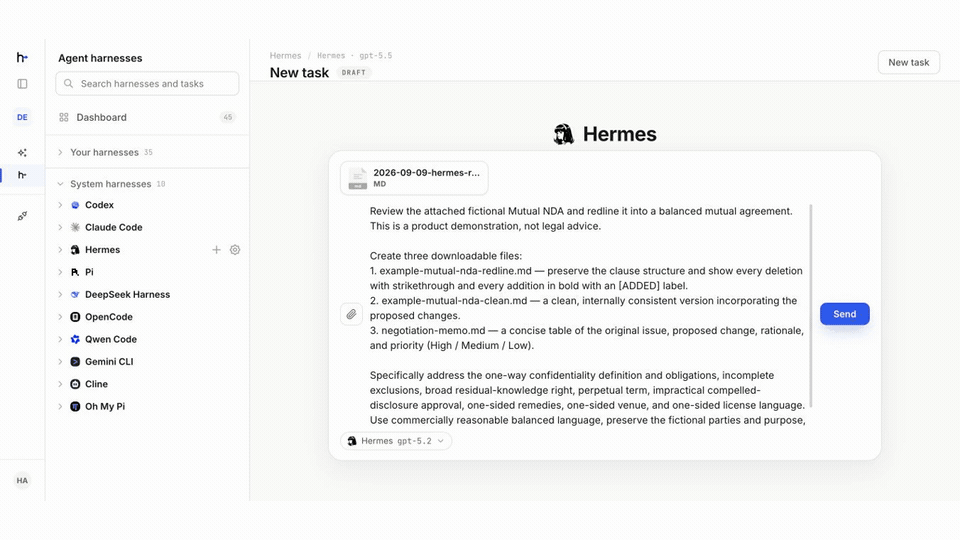
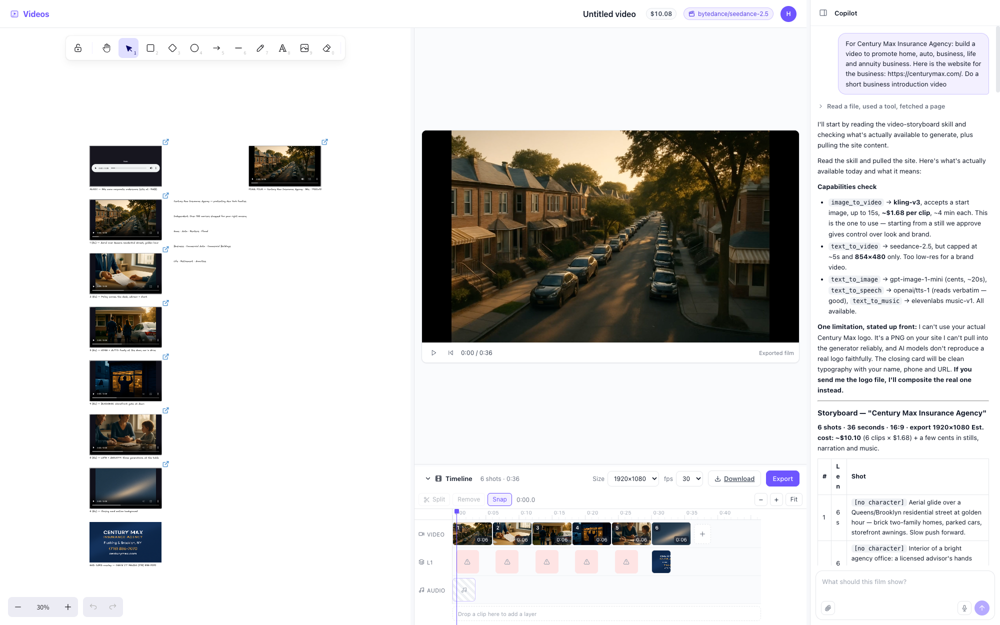

<div align="center">
  <a href="https://harnessrouter.ai/open-source">
    <picture>
      <source media="(prefers-color-scheme: dark)" srcset=".github/images/logo-dark.png">
      <source media="(prefers-color-scheme: light)" srcset=".github/images/logo-light.png">
      
    </picture>
  </a>
</div>

<div align="center">
  <strong>The world’s first unified interface for agent harnesses.</strong>
  <h3>Bring the world’s best agent harnesses into your product with one API.</h3>
  <p>
    Run Codex, Claude Code, Hermes, DeepSeek Harness, and a growing set of supported harnesses on
    infrastructure you control. Add or switch harnesses without redesigning your product backend.
  </p>
</div>

<div align="center">

[](https://github.com/HarnessRouter/harnessrouter)
[](./LICENSE)
[](https://hub.docker.com/r/harnessrouter/harnessrouter)
[](protocol/conformance/)

</div>

<div align="center">

[](https://discord.gg/nPcbwqVPb2)
[](https://linkedin.com/company/harnessrouter/)
[](https://x.com/HARNESSROUTER)

</div>



HarnessRouter Community Edition gives your product one consistent, OpenAI Responses-compatible
interface for running supported agent harnesses. It handles tasks and runs, sessions, streaming,
files, artifacts, cancellation, recovery, structured errors, and traces, so your product does not
need a separate backend integration for every harness.

### One interface. The freedom to choose.

<a href="https://harnessrouter.ai/benchmarks" title="Across many tasks, we have seen cost savings above 90%. In some cases, lower-cost configurations were also faster.">
  
</a>

<div align="center">
  <a href="https://github.com/HarnessRouter/harnessrouter">
    <picture>
      <source media="(max-width: 760px)" srcset="docs/images/github-readme-star-cta-mobile.svg">
      
    </picture>
  </a>
</div>

**Open source and self-hosted.** Community Edition is the Apache 2.0 reference implementation of
[Unified Harness Protocol (UHP)](https://unifiedharnessprotocol.org). It packages the Console, Gateway, and Runner in one
Docker deployment, with provider keys, state, and files on infrastructure you control.

## Quickstart

Start HarnessRouter with one Docker command. On the first launch, HarnessRouter installs the
supported harness CLIs you enable, so wait until the logs show `ready on :3000`. Then open the
console, connect a model provider, and run your first task.

### What you need

- Docker
- About 4 GB of disk space
- An API key from a supported model provider

No HarnessRouter account is required for Community Edition.

### 1. Start HarnessRouter

```bash
docker run -d --name harnessrouter \
  -p 127.0.0.1:3000:3000 \
  -v harnessrouter:/data \
  harnessrouter/harnessrouter
```

Docker pulls the image automatically if it is not already present. The named volume keeps your
database, files, installed harness CLIs, and workspaces between restarts.

### 2. Wait for the first launch

```bash
docker logs -f harnessrouter
```

The first launch takes longer while the enabled harness CLIs are installed. Continue when the logs
show:

```text
[harnessrouter] ready on :3000
```

### 3. Open the console

Open [http://localhost:3000](http://localhost:3000) and sign in with the initial local credentials:

| | |
|---|---|
| Username | `harnessrouter` |
| Password | `harnessrouter` |

Change the password from **Profile** before making the instance reachable from another machine.

<details>
<summary>See the sign-in screen</summary>


</details>

### 4. Connect a model provider

Open **Integrations**, select **Add Integration**, choose a provider, and add its API key. Provider
requests follow the provider and credentials you choose.


### 5. Run your first task

Open **Agent harnesses**, choose a supported harness, and select **New task**. Choose an available
model and give the agent something concrete to do. Progress streams into the same task while files,
artifacts, errors, and the final result remain attached to its session.



**Hermes, end to end:** attached fictional NDA → streamed review → redline, clean copy, and negotiation memo · 15-second silent loop

---

## Starter kits

Agent harnesses go far beyond coding. To help you explore what they can do and imagine what you
could build, we created starter kits for presentations, spreadsheets, dashboards, and videos.
Each includes an app, an agent configuration, and a Skill that guides the agent’s work.
More kits will be added over time.

<table>
  <tr>
    <td width="50%" valign="top">
      <strong>Slides</strong><br>
      Turn one brief into an editable presentation, with the agent’s work visible beside the canvas.<br><br>
      
    </td>
    <td width="50%" valign="top">
      <strong>Sheets</strong><br>
      Build structured tables and run an agent over each row while results fill in live.<br><br>
      
    </td>
  </tr>
  <tr>
    <td width="50%" valign="top">
      <strong>Dashboards</strong><br>
      Connect a database and turn questions into live, query-backed panels.<br><br>
      
    </td>
    <td width="50%" valign="top">
      <strong>Videos</strong><br>
      Plan, generate, arrange, and export a complete video from one workspace.<br><br>
      
    </td>
  </tr>
</table>

[Explore the Starter Kits repository →](https://github.com/HarnessRouter/starter-kit)

---

## One interface for the agent lifecycle

Your product integrates once with HarnessRouter instead of rebuilding the same lifecycle for each
harness.

| Contract | What your product receives |
|---|---|
| Tasks and runs | One way to start work and inspect its status |
| Sessions | Continuity across turns and resumable work |
| Streaming | Live progress and server-sent events |
| Files and artifacts | Structured inputs and retrievable finished work |
| Cancellation and recovery | Consistent controls when work changes or fails |
| Errors and traces | Structured failure details and a reviewable execution record |

Codex, Claude Code, Hermes, DeepSeek Harness, and a growing set of supported harnesses sit behind
this shared contract. The available catalog is shown by the running instance, so adding support does
not require your product backend to adopt another harness-specific interface.

## Use the API directly

The Console is a client of the same OpenAI Responses-compatible API your application uses. Sign in
once to keep a local session cookie, then run a turn:

```bash
curl -s -c hr.cookies http://localhost:3000/api/selfhost/login \
  -H 'content-type: application/json' \
  -d '{"username":"harnessrouter","password":"<your-password>"}'

curl -s -b hr.cookies http://localhost:3000/api/harness/v1/responses \
  -H 'content-type: application/json' \
  -d '{
    "input":"Reply with exactly: it works.",
    "metadata":{"harness_id":"codex"},
    "model":"gpt-5.4-mini",
    "stream":false
  }'
```

The task appears in the Console with the same session and transcript. Set `"stream": true` to
receive server-sent events.

## Why self-host Community Edition

- **Your infrastructure.** Console, Gateway, and Runner ship as one self-contained Docker deployment.
- **Your credentials and state.** Provider keys, sessions, files, and workspaces remain under your control. Model requests still go to the provider you configure.
- **Real workspaces.** Harnesses run with their native filesystem, shell, and Git workflows.
- **No separate harness backends.** Your application keeps one Task, Run, Session, File, Artifact, Error, and Trace contract as support grows.
- **A path to hosted scale.** Community Edition and HarnessRouter Cloud implement the same UHP contract.

## The Unified Harness Protocol

[Unified Harness Protocol (UHP)](https://unifiedharnessprotocol.org) is the public, versioned contract
implemented by Community Edition and HarnessRouter Cloud. This repository contains the Apache 2.0
reference implementation, machine-readable schemas, and the conformance suite.

| Resource | Purpose |
|---|---|
| [Specification](protocol/versions/2026-08-11/) | Normative protocol behavior |
| [OpenAPI and JSON Schema](protocol/schema/) | Machine-readable contracts |
| [Conformance suite](protocol/conformance/) | Testable compatibility requirements |
| [Governance](protocol/GOVERNANCE.md) | How the standard evolves |

## Architecture

```text
┌─ HarnessRouter container ──────────────────────────────────────────┐
│                                                                    │
│  Console :3000   ← only published port                             │
│       │ same-origin proxy                                          │
│       ▼                                                            │
│  Gateway :8080   Responses API + harness lifecycle                 │
│       │ loopback                                                   │
│       ▼                                                            │
│  Runner  :8081   one agent CLI process per session                 │
│                                                                    │
│  /data volume    database · files · secrets · workspaces           │
└────────────────────────────────────────────────────────────────────┘
```

Sessions have separate workspaces and conversation state. The Gateway and Runner listen on
loopback inside the container; the Console is the entry point for both the UI and API.

## Resources

- [Documentation and HarnessRouter Cloud](https://harnessrouter.ai)
- [Unified Harness Protocol](https://unifiedharnessprotocol.org)
- [Starter kits](https://github.com/HarnessRouter/starter-kit)
- [Discord](https://discord.gg/nPcbwqVPb2)
- [Contributing](CONTRIBUTING.md)
- [Security policy](SECURITY.md)

## License

HarnessRouter Community Edition is licensed under [Apache 2.0](LICENSE). Agent harness CLIs are
installed on first launch and remain subject to their respective upstream licenses.
