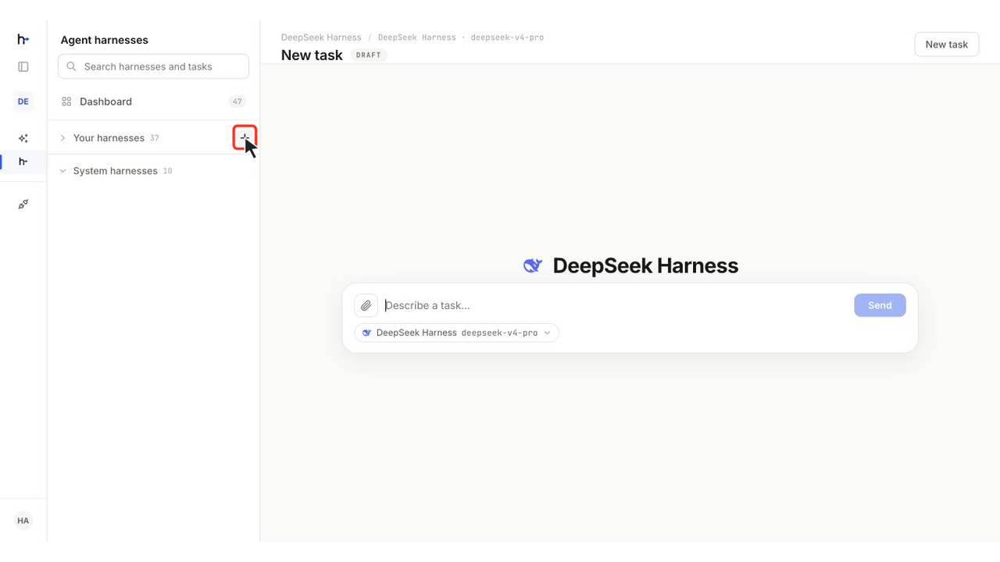

<p align="center"><strong>The world’s first unified interface for agent harnesses.</strong></p>

<p align="center">
  <a href="https://harnessrouter.ai/open-source">
    <picture>
      <source media="(prefers-color-scheme: dark)" srcset=".github/images/logo-dark.png">
      
    </picture>
  </a>
</p>

<h1 align="center">Build agent products without handling harness engineering.</h1>

<p align="center">
  Plug Codex, Claude Code, Hermes, DeepSeek Harness, and more into your product as agent backends.<br>
  <strong>One API for them all.</strong>
</p>

<p align="center">
  <a href="https://github.com/HarnessRouter/harnessrouter"></a>
  <a href="LICENSE"></a>
  <a href="https://hub.docker.com/r/harnessrouter/harnessrouter"></a>
  <a href="protocol/conformance"></a>
</p>

<p align="center">
  <a href="https://discord.gg/nPcbwqVPb2"></a>
  <a href="https://linkedin.com/company/harnessrouter/"></a>
  <a href="https://x.com/HARNESSROUTER"></a>
</p>

<p align="center">
  <a href="#quickstart">Quickstart</a> · <a href="#use-the-api-directly">API</a> · <a href="#starter-kits">Starter kits</a> · <a href="#local-to-cloud">Cloud</a>
</p>

<a id="what-it-is"></a>

<a id="one-integration"></a>

## N × M harness integrations → 1 unified interface.

N harnesses × M integration responsibilities. Connect your product once; HarnessRouter handles the harness-specific differences.


<a id="one-interface-the-freedom-to-choose"></a>

## Compare and switch harnesses. Optimize cost and latency.

<a href="https://harnessrouter.ai/benchmarks" title="In many cases, we’ve seen over 90% cost savings. Lower cost doesn’t always mean slower runs.">
  <picture>
    <source media="(max-width: 600px)" srcset="docs/images/benchmark-summary-mobile.svg">
    
  </picture>
</a>

<a href="https://github.com/HarnessRouter/harnessrouter">
  <picture>
    <source media="(max-width: 600px)" srcset="docs/images/github-readme-star-cta-mobile.svg">
    
  </picture>
</a>

**Open source and self-hosted.** Community Edition is the Apache 2.0 reference implementation of the [Unified Harness Protocol (UHP)](https://unifiedharnessprotocol.org). Run the Console, Gateway, and Runner in one Docker deployment on infrastructure you control.

[Run locally →](#quickstart) · [Prefer managed execution? Explore Cloud →](https://harnessrouter.ai)

<a id="install"></a>

## Quickstart

Start with one Docker command, wait for the first launch, then connect a model provider and run your first task.

<a id="what-you-need"></a>

**You need:** Docker · About **4 GB** of disk · A **provider API key**

No HarnessRouter account required. No bundled model or trial key.

### 1. Start HarnessRouter

```bash
docker run -d --name harnessrouter \
  -p 127.0.0.1:3000:3000 \
  -v harnessrouter:/data \
  harnessrouter/harnessrouter
```

Docker pulls the image if needed. The named volume preserves your database, files, installed harness CLIs, and workspaces between restarts.

<details>
<summary>Existing installation or custom setup</summary>

**Already installed?** `docker pull harnessrouter/harnessrouter` downloads the latest image but does not upgrade a running container. Follow the [upgrade and backup guide](docs/self-hosting-guide.md#restarts-upgrades-and-backups).

**Port 3000 busy?** Use `-p 127.0.0.1:3100:3000` and open port 3100 instead. Keep the loopback binding while using the initial credentials.

**Do not add `--user`.** The entrypoint and Runner need root to manage per-session users. The Console and Gateway run unprivileged; agent processes run as their session’s user.

For version pinning, Compose, and scripted setup, see the [setup guide](docs/self-hosting-guide.md#install).

</details>

### 2. Wait for the first launch

```bash
docker logs -f harnessrouter
```

The first launch installs the enabled harness CLIs. Continue when the logs show:

```text
[harnessrouter] ready on :3000
```

Press **Ctrl+C** to stop following logs. The container keeps running.

<details>
<summary>Console not ready or a harness missing?</summary>

If the browser refuses the connection, retry after a few seconds while the Console finishes starting. For a missing harness, check `backends available:` and any `requested but not installed` warning in the logs.

</details>

### 3. Open the console

Open [http://localhost:3000](http://localhost:3000), or your chosen host port, and sign in:

<table><tbody><tr><th scope="row">Username</th><td><code>harnessrouter</code></td></tr><tr><th scope="row">Password</th><td><code>harnessrouter</code></td></tr></tbody></table>

> [!WARNING]
> **Change the default password in Profile.** Keep the instance local until you change it. Saving briefly restarts the Console and signs out other browsers.

<details>
<summary>See the sign-in screen</summary>


</details>

Using an existing volume or custom credentials? [Check credential precedence and setup](docs/self-hosting-guide.md#install).

### 4. Connect a model provider

Open **Integrations → Add Integration**. Choose a provider, give the integration a name, and add its API key. Its supported models become available in the Console.

Model requests use the provider and credentials you choose.

<details>
<summary>See the provider setup screen</summary>


</details>

### 5. Run your first task

Open **Agent harnesses**, choose a supported harness, and select **New task**. Pick an available model and give the agent a concrete task. Follow live progress and open the files it produces in the same session.


<sub>In the illustrative run above, Hermes reviews a fictional NDA and produces a redlined version, a clean copy, and a negotiation memo.</sub>

<a id="configure-a-custom-harness"></a>

### Configure a custom harness (optional)

Built-in harnesses work without this step. Create a custom harness when you want reusable behavior tailored to your product.

1. **Create.** Select **New harness** in **Agent harnesses**. In **Add harness**, set the **Name**, **Base harness**, and **Default model** together, then select **Create and configure**.
2. **Customize.** In **Harness Settings**, add **Agent instructions**, configure **Tools** (use **Add MCP** for an optional MCP server), and add **Skills** as needed.
3. **Save and test.** Select **Save Changes**, then **Run Task** to test the saved configuration.

You can change the default model later in Settings, but the base harness cannot be changed after creation.

<details>
<summary>Watch the configuration walkthrough · 48 seconds</summary>

[](docs/images/2026-09-10-harnessrouter-custom-harness-feedback-configuration-v5.mp4?raw=true)

[▶ Watch the walkthrough · MP4 · 48 seconds](docs/images/2026-09-10-harnessrouter-custom-harness-feedback-configuration-v5.mp4?raw=true)

<sub>Customer-feedback analysis with DeepSeek Harness. The final still is a sidebar reference screenshot.</sub>

</details>

<a id="using-the-api"></a>

<a id="use-the-api-directly"></a>

## Integrate into your product with one API

With HarnessRouter running, connect your product to the same OpenAI Responses-compatible API used by the Console.

Sign in once to keep a local session cookie, then run a turn. To use your custom harness, replace `metadata.harness_id` with its **Harness ID**.

```bash
curl -s -c hr.cookies http://localhost:3000/api/selfhost/login \
  -H 'content-type: application/json' \
  -d '{"username":"harnessrouter","password":"<your-password>"}'

curl -s -b hr.cookies http://localhost:3000/api/harness/v1/responses \
  -H 'content-type: application/json' \
  -d '{
    "input":"Reply with exactly: it works.",
    "metadata":{"harness_id":"codex"},
    "model":"gpt-5.4-mini",
    "stream":false
  }'
```

The task appears in the Console with the same session and transcript. Set `"stream": true` to receive server-sent events.

Use your current username and password, adjust the port if needed, and choose a harness and model served by your connected provider.

<a id="one-interface-for-the-agent-lifecycle"></a>

<table>
        <thead><tr><th scope="col">Your application can…</th><th scope="col">How</th></tr></thead>
        <tbody>
          <tr><th scope="row">Start tasks</th><td>Send instructions and check execution status</td></tr>
          <tr><th scope="row">Continue sessions</th><td>Send follow-up instructions within the same session</td></tr>
          <tr><th scope="row">Stream progress</th><td>Receive live updates as the agent works</td></tr>
          <tr><th scope="row">Work with files</th><td>Attach input files and retrieve generated outputs</td></tr>
          <tr><th scope="row">Cancel tasks</th><td>Stop work that is no longer needed</td></tr>
          <tr><th scope="row">Inspect execution</th><td>Review structured errors and execution traces</td></tr>
        </tbody>
      </table>

Treat agent harnesses as an **AI infrastructure layer**, like databases or model APIs. HarnessRouter gives your product one unified interface to this **harness layer**.

See the [API guide](docs/self-hosting-guide.md#using-the-api) for catalogs, sessions, cancellation, and traces. For the full API contract, see the [Unified Harness Protocol (UHP) specification](https://unifiedharnessprotocol.org/spec).

<a id="starter-kits"></a>

## See where agent harnesses fit in your product

Plug agent harnesses into your own interface to power features and tasks far beyond coding. To help you explore what’s possible, we created starter kits for presentations, spreadsheets, dashboards, and videos. More kits will be added over time.

<table>
  <tr>
    <td width="50%" valign="top">
      
      <h3>Slides</h3>
      <p>An agent harness creates slides from your brief; you edit the text, layout, and style on the canvas.</p>
    </td>
    <td width="50%" valign="top">
      
      <h3>Sheets</h3>
      <p>An agent column runs a harness-backed agent for each row, using preceding columns as input and filling cells with results.</p>
      <p>Requires another agent for the agent column.</p>
    </td>
  </tr>
  <tr>
    <td width="50%" valign="top">
      
      <h3>Dashboards</h3>
      <p>An agent harness reads your database schema and writes SQL for charts; the dashboard refreshes queries when opened.</p>
      <p>Requires a database connection.</p>
    </td>
    <td width="50%" valign="top">
      
      <h3>Videos</h3>
      <p>An agent harness plans shots and uses video tools to generate clips; you edit them on a timeline and export the film.</p>
      <p>Video generation has additional per-clip costs.</p>
    </td>
  </tr>
</table>

[Explore the Starter Kits repository →](https://github.com/HarnessRouter/starter-kit)

Starter Kits have [separate licensing terms](https://github.com/HarnessRouter/starter-kit#licensing) from Community Edition.

<details>
<summary>Before launching a kit</summary>

Open **Starter Kits** in the Console. Select a harness and model supported by your connected providers.

**Dashboards:** use a reachable database and a read-only database account. Set `HR_SECRET_KEY` to encrypt stored connections, and review the sample-row setting before connecting.

[Read the kit setup guide →](docs/self-hosting-guide.md#starter-kits)

</details>

## Deployment choices

<a id="why-self-host-community-edition"></a>

<a id="why-self-host"></a>

### Self-host for control

- **Your infrastructure.** One Docker deployment for the Console, Gateway, and Runner.
- **Your credentials and state.** Provider keys, sessions, files, and workspaces stay under your control. Model requests still go to your configured provider.
- **Real workspaces.** Native filesystem, shell, and Git workflows, with separate session workspaces.
- **No Console product analytics.** Community Edition disables the Console analytics pipeline.

<a id="local-to-cloud"></a>

<a id="cloud-heading"></a>

### Choose your path to Cloud

Choose **HarnessRouter Cloud** for managed deployment, maintenance, and scaling, with tasks running in serverless, isolated sandboxes through the same API contract.

| Local → Cloud | Start directly in Cloud |
|---|---|
| Bring a custom harness you’ve configured locally.<br>[Follow the upload guide →](docs/self-hosting-guide.md#moving-to-the-hosted-service) | Create and run harnesses without a local deployment.<br>[Open HarnessRouter Cloud →](https://harnessrouter.ai) |

**For local uploads:** set `HR_SECRET_KEY` on your local instance to encrypt the saved destination key. Save your custom harness in **Settings**, select **Upload to Cloud**, then connect a destination using its Cloud workspace API key.

Uploads copy harness configuration, not provider keys, sessions, or generated files. Uploading again replaces that destination’s hosted copy.

<a id="architecture"></a>

### Inside Community Edition

```text
┌─ HarnessRouter container ─────────────────────────────────┐
│  Console :3000   ← only published port                    │
│       │ same-origin proxy                                 │
│       ▼                                                   │
│  Gateway :8080   Responses API + harness lifecycle        │
│       │ loopback                                          │
│       ▼                                                   │
│  Runner  :8081   runs harnesses in session workspaces     │
│                                                           │
│  /data volume   database · files · secrets · workspaces   │
└───────────────────────────────────────────────────────────┘
```

The Gateway and Runner listen on loopback inside the container. Sessions use separate workspaces and operating-system users, not separate containers. The Console is the entry point for both UI and API.

See [configuration](docs/self-hosting-guide.md#configuration), [upgrades and backups](docs/self-hosting-guide.md#restarts-upgrades-and-backups), and [public deployment with TLS](docs/self-hosting-guide.md#putting-it-on-a-public-url).

<a id="unified-harness-protocol"></a>

## The Unified Harness Protocol

[Unified Harness Protocol (UHP)](https://unifiedharnessprotocol.org) is the public, versioned contract implemented by Community Edition and HarnessRouter Cloud. This repository contains the Apache 2.0 reference implementation, machine-readable schemas, and the conformance suite.

<table>
        <thead><tr><th>Resource</th><th>Purpose</th></tr></thead>
        <tbody>
          <tr><td><a href="protocol/versions/2026-08-11">Specification</a></td><td>Normative protocol behavior</td></tr>
          <tr><td><a href="protocol/schema">OpenAPI and JSON Schema</a></td><td>Machine-readable contracts</td></tr>
          <tr><td><a href="protocol/conformance">Conformance suite</a></td><td>Testable compatibility requirements</td></tr>
          <tr><td><a href="protocol/GOVERNANCE.md">Governance</a></td><td>How the standard evolves</td></tr>
        </tbody>
      </table>

## Resources

| Goal | Resources |
|---|---|
| **Build** | [Cloud & integration docs](https://harnessrouter.ai/docs) · [API guide](#use-the-api-directly) · [Starter kits](https://github.com/HarnessRouter/starter-kit) |
| **Deploy** | [Setup & operations](docs/self-hosting-guide.md) · [Local → Cloud](#local-to-cloud) · [HarnessRouter Cloud](https://harnessrouter.ai) |
| **Protocol** | [Unified Harness Protocol (UHP)](https://unifiedharnessprotocol.org) |
| **Community** | [Discord](https://discord.gg/nPcbwqVPb2) · [Contributing](CONTRIBUTING.md) · [Security](SECURITY.md) |

## Star History

<p align="center">
  <a href="https://www.star-history.com/?repos=harnessrouter%2Fharnessrouter&amp;type=date&amp;legend=top-left">
    <picture>
      <source media="(prefers-color-scheme: dark)" srcset="https://api.star-history.com/chart?repos=harnessrouter/harnessrouter&amp;type=date&amp;theme=dark&amp;legend=top-left">
      <source media="(prefers-color-scheme: light)" srcset="https://api.star-history.com/chart?repos=harnessrouter/harnessrouter&amp;type=date&amp;legend=top-left">
      
    </picture>
  </a>
</p>

## License

HarnessRouter Community Edition is licensed under [Apache 2.0](LICENSE). Agent harness CLIs are installed on first launch and remain subject to their respective upstream licenses. See [NOTICE](NOTICE) for third-party notices and the [Starter Kits repository](https://github.com/HarnessRouter/starter-kit#licensing) for its separate licensing terms.
