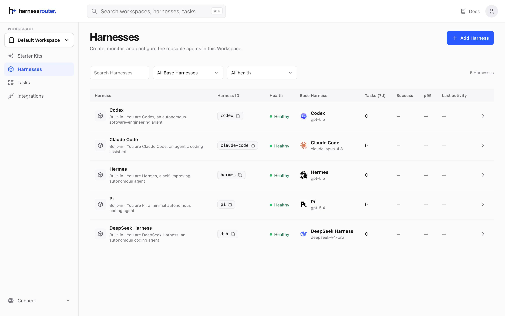
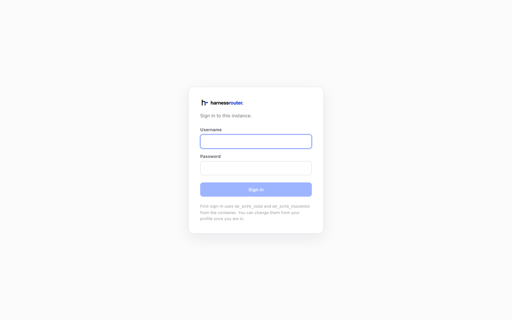
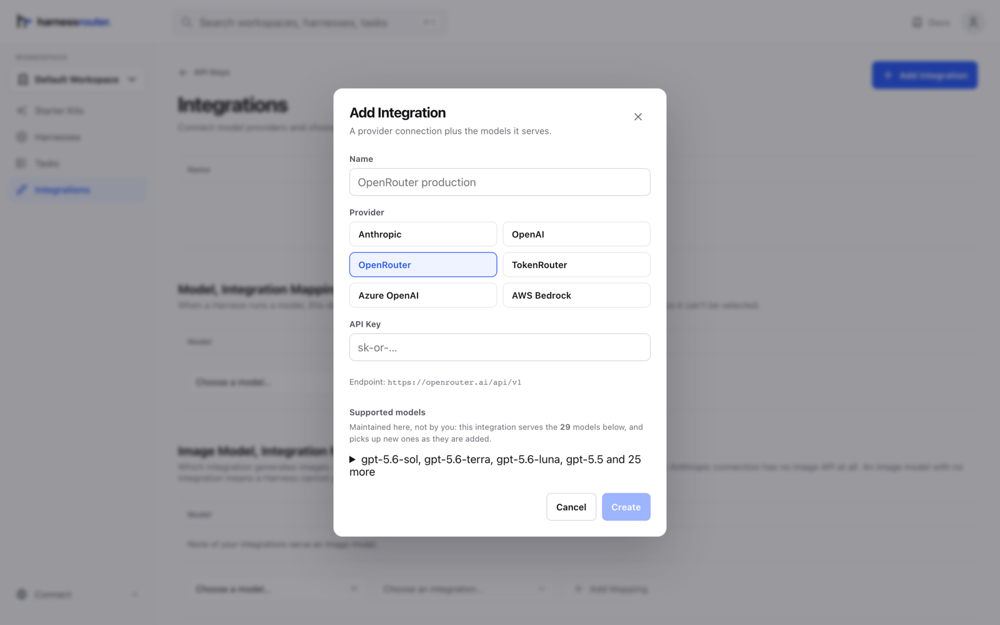
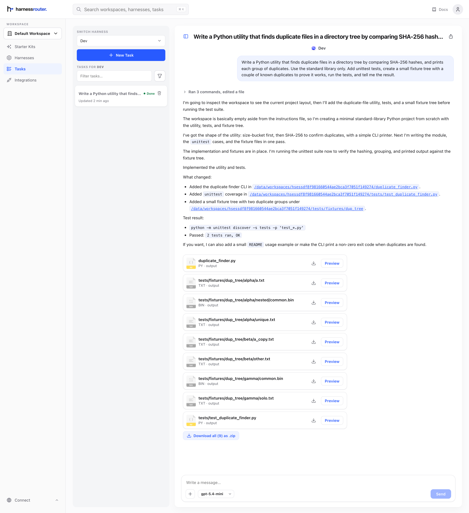
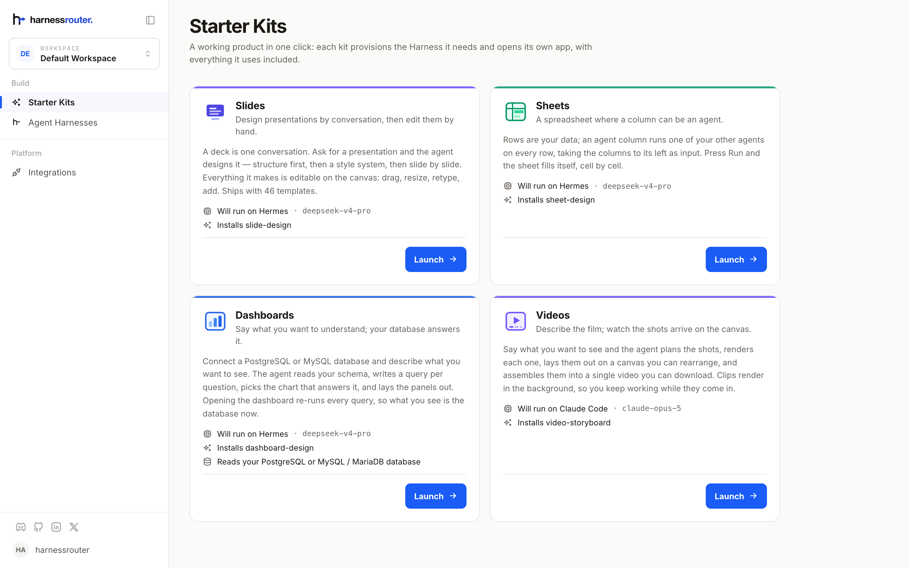
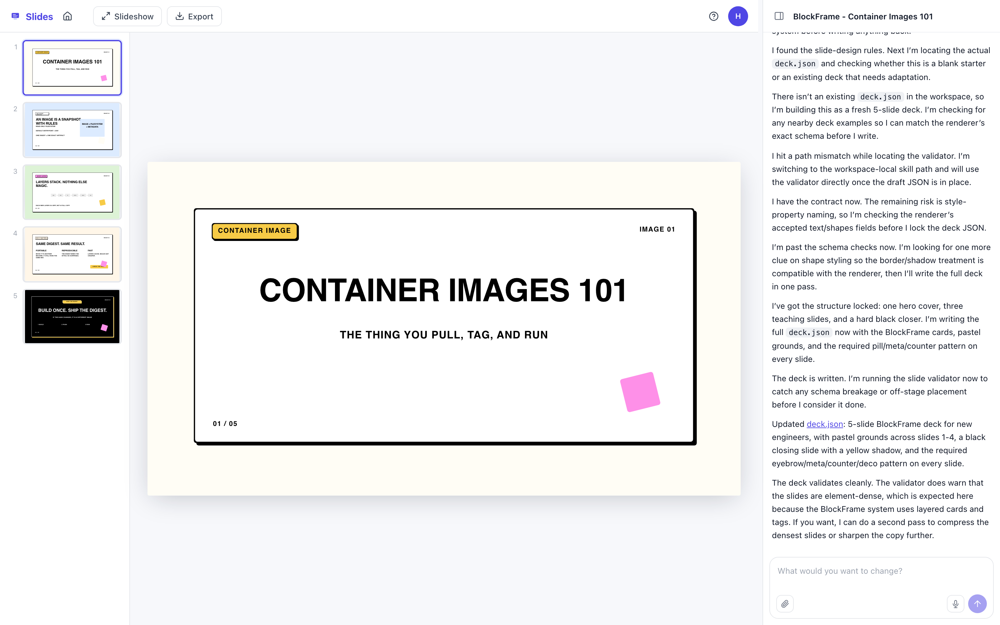
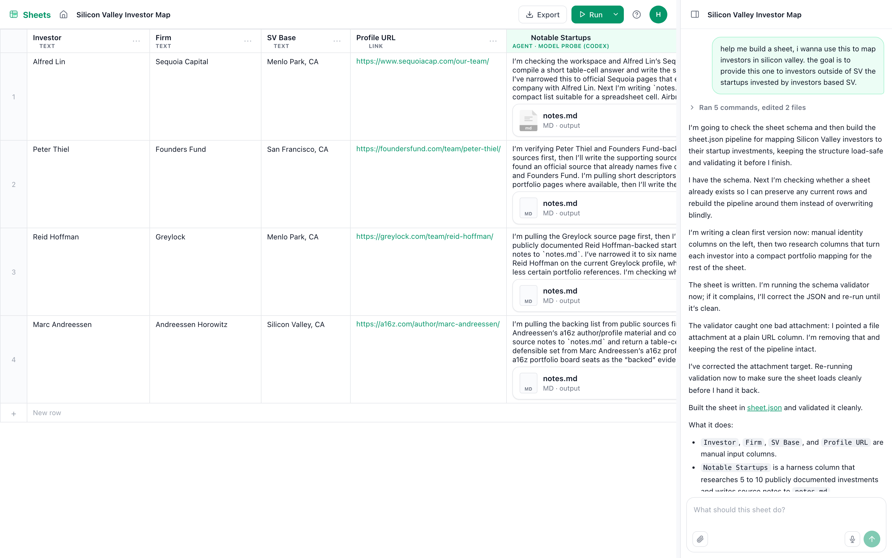
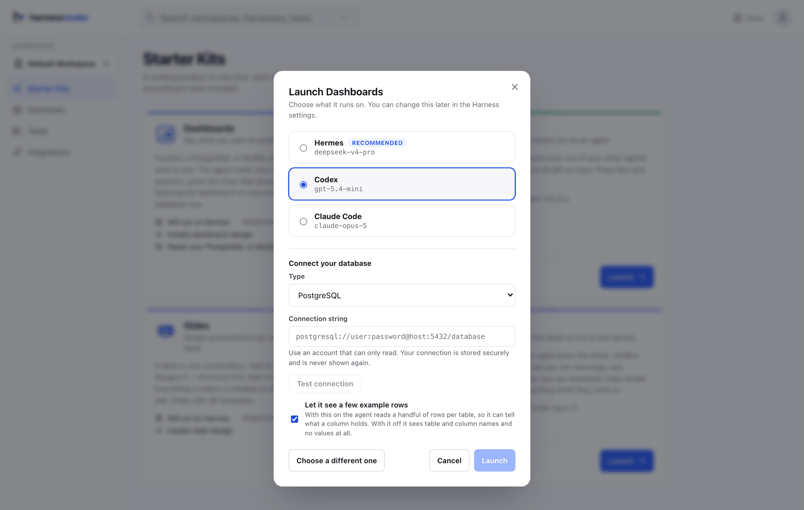
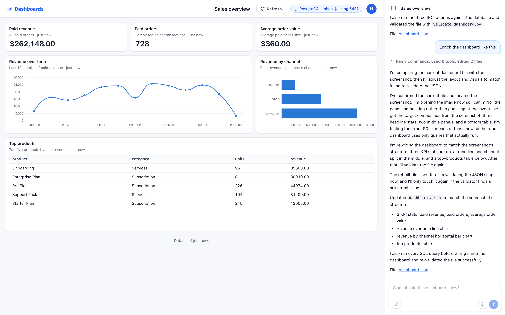

<div align="center">
  <a href="https://harnessrouter.ai">
    <picture>
      <source media="(prefers-color-scheme: dark)" srcset=".github/images/logo-dark.png">
      <source media="(prefers-color-scheme: light)" srcset=".github/images/logo-light.png">
      
    </picture>
  </a>
</div>

<div align="center">
  <h3>Run agent harnesses on your own machine.</h3>
</div>

<div align="center">

[](./LICENSE)
[](https://hub.docker.com/r/harnessrouter/harnessrouter)
[](https://discord.gg/nPcbwqVPb2)
[](https://x.com/HARNESSROUTER)
[](protocol/conformance/)

</div>

<br>

**Run agent harnesses on your own machine.** One container, your own API keys, your
own data. Configure a harness, give it work, watch it run, with no account, no cloud, and no telemetry. Community Edition implements the [Unified Harness Protocol (UHP)](https://unifiedharnessprotocol.org), the open standard the hosted service implements too.

> [!TIP]
> New here? Start with [What it is](#what-it-is), or read the protocol at [unifiedharnessprotocol.org](https://unifiedharnessprotocol.org).



---

## Install

Six steps, and at the end of them you have a running instance, a signed-in console, and an agent
that has answered you.

You need Docker, about 4 GB of disk, and an API key from a model provider. There is no account to
create and nothing to sign up for. The provider key is the only credential in the story, and it
never leaves the box except to call the provider it belongs to.

### 1. Pull the image

```bash
docker pull harnessrouter/harnessrouter
```

About 700 MB to download.

`latest` is the current release, and pulling it again is how you upgrade. Pin a version only
when you need two machines to run the same bytes, by naming a version in a compose file you share
with a team. Releases are listed on [Docker Hub](https://hub.docker.com/r/harnessrouter/harnessrouter/tags).

### 2. Run it

Copy this line as it is. Nothing in it is a placeholder.

```bash
docker run -d --name harnessrouter \
  -p 127.0.0.1:3000:3000 \
  -v harnessrouter:/data \
  harnessrouter/harnessrouter
```

No provider key here. The instance comes up without one and you connect a provider from the console
in step 5, which is the shorter road: a key pasted into a form cannot be misspelled into a shell
history, and changing it later does not mean recreating the container.

No password here either. The instance starts on the default login — username `harnessrouter`,
password `harnessrouter` — which is safe enough while `-p 127.0.0.1:` keeps it on loopback, and
which you change from the console in step 4. Set it here instead if you would rather, but then it
is that password you sign in with, not the default one.

Two parts of that line are load-bearing. `-p 127.0.0.1:` keeps the console reachable only from this
machine. If port 3000 is already busy, change only the left-hand number
(`-p 127.0.0.1:3100:3000`), because the container always listens on 3000 inside. And
`-v harnessrouter:/data` is where everything durable lives, including the agent CLIs installed in
the next step, so keeping that volume is what makes the second start fast.

<details>
<summary>Choosing your own username and password at <code>docker run</code></summary>

Two optional variables. Set them and they replace the defaults; the console never shows you the
default login again.

```bash
docker run -d --name harnessrouter \
  -p 127.0.0.1:3000:3000 \
  -v harnessrouter:/data \
  -e HR_AUTH_USER=you \
  -e HR_AUTH_PASSWORD=the-password-you-chose \
  harnessrouter/harnessrouter
```

Whatever you put after `HR_AUTH_PASSWORD=` **is** the password — sign in with exactly that in step
4. You do not need this to get started, and changing the password from the profile page later works
just as well; it exists for a box built by a script, where nobody is going to open a browser.

</details>

<details>
<summary>Using Docker Compose instead</summary>

`cp .env.example .env`, then `docker compose up -d`. Read `docker-compose.yml` first: it publishes
`3000:3000` on every interface rather than on loopback. Change that one line and it behaves like the
command above.

</details>

### 3. Wait for it to say it is ready

**Do not open the browser yet.** The container returns your prompt in about a second, but the
console is not up for roughly another half a minute, and until it is, <http://localhost:3000>
refuses the connection. That is the first-run install still working, not a broken container.

Watch for the line that says it is ready:

```bash
docker logs -f harnessrouter
```

**Most of that half a minute looks like nothing is happening.** This is what it says:

```
[harnessrouter] installing Claude Code (Anthropic's terms apply)…
[harnessrouter] installing Codex (Apache-2.0)…
[harnessrouter] installing Hermes (check its upstream license before use)…
[harnessrouter] data=/data  backends available: claude codex hermes
[harnessrouter] ready on :3000
   ▲ Next.js 15.5.23
   - Local:        http://5e9ac64dd926:3000
   - Network:      http://5e9ac64dd926:3000

 ✓ Starting...
 ✓ Ready in 123ms
```

**`ready on :3000` is the line you are waiting for.** Once it appears, open the browser and go to
step 4. `backends available:` is the other one worth reading: it lists what actually installed, so a
backend that failed is named rather than silently missing, and the others still work.

This wait happens once per volume, not once per start. Every start after it takes a few seconds and
prints no install lines at all.

You will also see this line, and it comes back on every start until you change the password in step
4. On a loopback-only instance it is a reminder rather than a problem:

```
[harnessrouter] WARNING: using the DEFAULT password. Set HR_AUTH_PASSWORD, or change it from the profile page, before exposing this instance.
```

<details>
<summary>Why the agent CLIs are installed on first run instead of shipped in the image</summary>

It is a licensing fact rather than a packaging preference. Claude Code is distributed under
Anthropic's own terms and hermes-agent declares no license at all, so neither can be redistributed
inside a public image. Installing them on first run means you install them yourself, from upstream,
under those terms — which is also why you should read them before you use those two backends. Codex
is Apache-2.0 and arrives the same way, so all three land in one place.

</details>

### 4. Sign in

Open <http://localhost:3000>. The console is behind a login, on by default, covering the pages and
the API alike:



If you ran the command in step 2 as printed, sign in with:

| | |
|---|---|
| Username | `harnessrouter` |
| Password | `harnessrouter` |

Those are the defaults, and printing them here is what makes them a placeholder rather than a
secret — which is why the container nags you about the password on every start until you change it.
If you set `HR_AUTH_USER` or `HR_AUTH_PASSWORD` yourself, sign in with what you set instead; the
defaults are then refused.

**Change the password now**, from **Profile**, in the account menu at the top right. It asks for the
current password as well as the new one, so an unattended tab cannot be used to take over the
instance. They are then stored on the data volume (`/data/selfhost-auth.json`: a username, a salt
and a hash, never the password) and take precedence over the environment from then on. An
`HR_AUTH_PASSWORD` set at `docker run` months ago cannot quietly undo a password change; after one,
the environment's password is refused and the start-up line changes to say where the real one came
from:

```
[harnessrouter] sign in as 'harnessrouter' (credentials set from the profile page)
```

Saving signs out every other browser and restarts the console, which takes about a second. Yours
stays signed in.

Forgot it? There is no reset email to send, so delete `/data/selfhost-auth.json` and restart. The
instance falls back to `HR_AUTH_USER` / `HR_AUTH_PASSWORD`.

### 5. Connect a model provider

**Nothing runs until you do this.** There is no bundled model, no trial key, and no free tier
hiding in the image. The instance you just signed into will do everything except answer you, which
is what this step buys.

Open **Integrations** and press **Add Integration**. It asks three things: a name, the provider,
and your API key.



Which models that provider serves is not your problem to configure: the product keeps that list
and adds to it as providers ship models. Pick the provider, paste the key, and the models it
covers appear on the row.

If you run more than one provider, the mappings underneath decide which one serves a given model.
With a single integration there is nothing to set.

<details>
<summary>Setting it from the environment instead, for a scripted deploy</summary>

A connection names a provider and its credential; a policy says which connection a backend uses.
Useful when the box is built by a script and nobody is going to open a browser:

```bash
-e HR_SECRET_GLOBAL_HARNESS_CONN_ANTHROPIC='{"name":"anthropic","provider":"anthropic","api_key":"sk-ant-…"}'
-e HR_SECRET_GLOBAL_HARNESS_POLICY_CLAUDE='{"chain":["anthropic"]}'
```

There is one policy variable per backend: `…POLICY_CLAUDE`, `…POLICY_CODEX`, `…POLICY_HERMES`. An
OpenAI-compatible endpoint of your own takes the same pair with a `base_url` added, and
`"provider":"openai"` rather than the `"openai-api"` that `.env.example` still shows:

```bash
-e HR_SECRET_GLOBAL_HARNESS_CONN_LOCAL='{"name":"local","provider":"openai","api_key":"…","base_url":"https://api.example.com/v1"}'
-e HR_SECRET_GLOBAL_HARNESS_POLICY_CODEX='{"chain":["local"]}'
```

Not every provider fits every backend, and a pairing that does not fit fails quietly: the turn
comes back empty after a long wait rather than erroring. The Integrations page does not have this
problem, because it only offers you providers that work.

| Connection `provider` | Backends that can use it |
|---|---|
| `anthropic` | Claude Code, Hermes |
| `openai` | Codex, Hermes |
| `openrouter` | Codex, Hermes |
| `azure-foundry` | Codex, Hermes |
| `bedrock` | Claude Code, Hermes |
| `tokenrouter` | Claude Code, Codex, Hermes |
| `vercel` | Claude Code, Codex, Hermes |

</details>

A backend with nothing connected is forthcoming about it, which is what you get if you skip this
step entirely:

```json
{"error":{"type":"invalid_request_error","code":"invalid_input","message":"no provider configured for backend 'codex'. Add an integration for a provider that serves 'gpt-5.4-mini', or configure a connection policy"}}
```

### 6. Give it something to do

**Tasks → New Task.** Pick a harness in the switcher on the left, choose a model next to the
message box, and type. The turn streams back as it happens: every command the agent runs, every
file it touches, and the answer at the end.



That one asked for a small utility with tests. The agent wrote it, built a fixture tree with
duplicates planted in it, ran the suite, and came back with `2 tests ran, OK`, which is an answer
you can check rather than one you have to trust. Everything it produced is on the transcript to
take away, a file at a time or the lot as a zip.

That is the whole install. State is SQLite and files on one Docker volume. Delete the volume and
the instance is gone; copy it and you have moved the instance, harnesses, transcripts and all.

---

## Starter kits

Starter kits are worked examples, and they are here to show you what this can be pointed at.

Each one is a whole agent product rather than a snippet: an app, an agent configured to drive it,
and the skill that teaches that agent the format it writes. Use one, then read it: every kit is
open source, and the distance between "I see how Slides works" and "I can build the one my
customers need" is meant to be short. More arrive over time; your instance lists the ones it has.



Each card names the base and the model it will run on before you launch it, so you can see what a
kit is about to spend before it spends it. What it names depends on the keys you gave it in step 5:
the screenshot above is an instance with three providers connected, and an instance with one will
recommend that one on every card. Launching asks a single question, what to run it on, and the
runtimes you have no key for are listed but disabled, with the reason on them:

> Hermes · `deepseek-v4-pro` · Not connected. Add a provider that serves this model to use it.

What the dialog recommends is a suggestion you can overrule, not a default you have to accept.

### Slides

A deck is one conversation. Ask for a presentation and the agent designs it: structure first, then
a style system, then slide by slide.

The deck below came from one sentence: *"A 5-slide deck explaining what a container image is, for
new engineers."*



That sentence is at the top of the panel on the right, and everything under it is the run, not a
progress bar. It settled the structure, built a style system, checked what the canvas would accept,
wrote the deck, then validated it, and it says so as it goes. Slides appear while it works, so when
the shape is wrong you can say so while there are two slides to change instead of twenty.

Nothing here is a picture of a slide: every element is a real object on the canvas, so you can drag
it, resize it, retype it, or ask for another pass in the same conversation.

### Sheets

Rows are your data. An agent column runs one of your harnesses on every row, with the columns to
its left as input, and the sheet fills itself cell by cell.

This one opened with *"help me build a sheet, i wanna use this to map investors in silicon valley.
the goal is to provide this one to investors outside of SV the startups invested by investors based
SV."*



From that, the agent decided the columns, worked out which of them a person fills in and which one
an agent should, and wrote the per-row prompt itself. The rows came from a follow-up, *"search some
real data and from internet"*, and it went and found four real investors with their firm's own
profile pages rather than inventing plausible ones.

Then you press Run, and the agent column fills in row order with a live count and a Stop button,
because a column of a thousand rows is a thing you should be able to change your mind about.

**One thing to know on a brand-new instance.** An agent column runs one of your *other* agents, and a
sheet will not run itself, so on an instance where Sheets is the only thing you have launched, the
column menu has nothing to offer and says so:

> Choose an agent… · You have no other agents yet. Create one, then choose it here.

**Harnesses → Add Harness** is the fix: a base, a model, a name, and it is ready in seconds. The
picker then lists it with the model it runs on. If you add one while a sheet is open, reload the
sheet first, because the list is read when the page loads.

### Dashboards

Say what you want to understand and point it at a database. The agent reads your schema, writes a
query per question, picks the chart that answers it, and lays the panels out. Opening the dashboard
re-runs every query, so what you see is the database now, not a snapshot from whenever it was
built.



This is the one kit with setup, and it is two fields: the connection and the sample-rows switch.

The one below opened with *"Revenue by month and the top 5 countries by revenue, plus total paid
revenue."* Both turns of that conversation are in the panel on the right: the first built it, and
the second, *"Enrich the dashboard like this"* with a picture of the layout attached, is where the
panels you see came from.



There is nowhere in a dashboard to type a number. Every figure on that page is the result of a
query that ran when the page opened, which is the property that makes it worth trusting. Ask for a
change and it runs each query before it wires it into a panel, so a panel that renders is a panel
whose query works.

<details>
<summary>Connecting a database</summary>

Three things to know before you connect one.

**The container has to be able to reach it.** If your database is another container, put both on
the same user-defined network so the database's *name* resolves. Docker's default bridge has no
DNS, so on it only the container's IP works, and that IP changes:

```bash
docker network create hr-net
docker network connect hr-net my-postgres
docker run -d --name harnessrouter --network hr-net \
  -p 127.0.0.1:3000:3000 -v harnessrouter:/data … harnessrouter/harnessrouter
```

Then `my-postgres:5432` works as a host in the connection string. A database on the host machine
rather than in a container is reachable at `host.docker.internal` on Docker Desktop, or via
`--add-host=host.docker.internal:host-gateway` on Linux.

**Set `HR_SECRET_KEY`.** Connection strings are encrypted at rest under a key derived from it,
and without it the server refuses to store one rather than writing your production credential to
disk in plaintext:

```bash
-e HR_SECRET_KEY=a-long-random-passphrase
```

Keep it. Change it and the stored connections can no longer be decrypted, and you reconnect them.

**Use a read-only database account.** Every statement is checked and only `SELECT` is allowed,
non-`SELECT`, multiple statements and data-modifying CTEs are refused, and on PostgreSQL the
query additionally runs in a `READ ONLY` transaction. That check is a parser, and a parser is a
thing that can be wrong. An account that has been granted `SELECT` and nothing else is a second
defence that does not depend on ours being right:

```sql
CREATE USER dashboards WITH PASSWORD '…';
GRANT CONNECT ON DATABASE shop TO dashboards;
GRANT USAGE ON SCHEMA public TO dashboards;
GRANT SELECT ON ALL TABLES IN SCHEMA public TO dashboards;
```

The connection string is resolved at the moment a query runs. The agent's sandbox never receives
it. It gets a tool that runs `SELECT`s, and neither does the browser.

**Sample rows** are a per-connection switch, on by default: the agent sees a few real rows per
table so it can tell a status column from a category one. Turn it off and it sees table and
column names and types and no values at all.
</details>

### Videos

The fourth kit describes a film and gets one back: it plans the shots, renders each, lays them out
on a canvas you can rearrange, and assembles them into a single video you can download. Clips
render in the background, so you keep working while they arrive.

It is the one kit that spends real money per second of output rather than per turn, because every
shot is a generation. Try it once you already know what the console is
doing.

---

## What it is

An *agent harness* is the runtime layer around a model; Codex, Claude Code, and Hermes are harnesses. In this repo's API you also create *harness* objects: a saved configuration whose `base` is one of those runtimes, plus a model, instructions, and limits. A *task* is one run of that configuration, a real conversation against a real POSIX workspace with bash and git, streamed back as it happens.

HarnessRouter Community Edition implements UHP for both: an OpenAI **Responses-compatible** API for
running turns, harness CRUD, sessions, streaming, cancellation, and idempotency. The console is
a thin client over that API; anything the UI does, you can do from `curl`.

**The console is the hosted product's console.** Not a cut-down rebuild: the same pages, the
same components, the same API client. Surfaces that need a service a single box doesn't have,
such as accounts, billing, and marketplace, are simply not shown.

**Supported harnesses:** Codex, Claude Code, and Hermes, installed on first run rather than shipped
in the image, for the license reasons in step 3. Review each tool's terms before you use it.

**Bring your own key.** Your provider credentials are read from the environment at start-up and
handed to the agent directly. They are never written into the image, never committed, and never
sent anywhere but your provider.

## Why self-host

- **Your keys, your bills, your data.** Nothing leaves the box except calls to your model provider.
- **Real workspaces.** Agents get bash, git, and a filesystem, their native environment, not a
  sandbox emulation.
- **The same API as the hosted product.** Not a reduced fork: the same `/v1` surface, so anything
  you build against it keeps working if you later move to the hosted service.
- **Actually self-contained.** No control plane to phone home to, no managed database.

## The Unified Harness Protocol

This repository is both an implementation and a standard. The protocol the gateway speaks is
specified, versioned and testable in [`protocol/`](protocol/), and documented at
[unifiedharnessprotocol.org](https://unifiedharnessprotocol.org):

| | |
|---|---|
| [Specification](protocol/versions/2026-08-11/) | Ten normative chapters, version `2026-08-11` |
| [Machine-readable](protocol/schema/) | OpenAPI 3.1 + JSON Schema 2020-12, generated from one source |
| [Conformance suite](protocol/conformance/) | passing it is what "conformant" means, and what earns the right to the UHP name |
| [Governance](protocol/GOVERNANCE.md) | How the standard changes, and the naming and conformance policy |

This edition is the reference implementation. The most recent published run
[passes at class Full](protocol/conformance/reports/harnessrouter-ce-0.3.0.json), against 0.3.0.
**The standard can be implemented without HarnessRouter Cloud**: it is an HTTP contract, and
nothing in it requires a hosted service. Run the suite against your own server:

```bash
pip install -e protocol/conformance
uhp-conformance --base-url https://your-server --api-key "$KEY" --class full
```

## Configuration

<details>
<summary>Choosing backends, and building with a browser</summary>

Backends are installed into your data volume rather than baked into the image, so which ones you
want is a run-time setting:

```bash
docker run -e HR_BACKENDS=claude,codex,hermes ...   # the default
```

**Known issue: any value that leaves out `hermes` makes the container exit immediately**
with status 1 and no error message. `claude`, `codex` and `claude,codex` all do it, and the last
line in the log is the install line for the backend it was working on, so it reads as if the
install killed it, which it did not. Until that is fixed, leave `HR_BACKENDS` unset.

Chromium is genuinely an image layer, so it stays a build flag:

```bash
docker build -t harnessrouter --build-arg WITH_BROWSER=1 .
```
</details>

<details>
<summary>What the entrypoint sets for you</summary>

| Variable | Default | Why |
|---|---|---|
| `HR_BACKING` | `local` | SQLite + files on `/data`. No external storage. |
| `HR_IDENTITY_MODE` | `off` | One box, one owner; an accounts system would be ceremony with nothing behind it. |
| `HR_CREDIT_GATE` | `off` | Metering is a hosted concern. |
| `POOL_MGMT_ENDPOINT` | `http://127.0.0.1:8081` | The runner is in this container. |
| `HR_POOL_AUTH` | `none` | No cloud identity to present to a loopback runner. |
| `HR_SANDBOX_TRUST` | `owner` | You own the box, the agent and the key, so the key is handed over directly rather than brokered. |
| `HARNESS_WORKSPACE` | `/data/workspaces` | One directory per session, on the volume, so a restart doesn't discard work in flight. |
| `HR_WORKSPACE_TTL_HOURS` | `72` | Idle session workspaces are removed after this. They rehydrate from their checkpoint, so this costs time, not work. `0` keeps them forever. |
| `HARNESS_INTERNAL_KEY` | generated | Per-container; never leaves the process tree. |

</details>

## Using the API

The console is optional: it is a thin client over the same API. On a default install that API is
reached through the console's own port, and **the login gate covers it too**, so a call needs the
session cookie. Sign in once and keep the cookie:

```bash
curl -s -c hr.cookies http://localhost:3000/api/selfhost/login \
  -H 'content-type: application/json' \
  -d '{"username":"harnessrouter","password":"YOUR_PASSWORD"}'
# {"ok":true}
```

Then run a turn. The gateway speaks the Responses API:

```bash
curl -s -b hr.cookies http://localhost:3000/api/harness/v1/responses \
  -H 'content-type: application/json' \
  -d '{"input":"Reply with exactly this and nothing else: it works.",
       "metadata":{"harness_id":"codex"},
       "model":"gpt-5.4-mini",
       "stream":false}'
```

```json
{"id":"resp_284e450bc2be4de8bea94c4af6030292","object":"response","created_at":1786822334,
 "status":"completed","error":null,"incomplete_details":null,"previous_response_id":null,
 "model":"gpt-5.4-mini",
 "output":[{"id":"msg_3d71e018c6584abbb063ee16d9a36e75","type":"message","status":"completed",
            "role":"assistant",
            "content":[{"type":"output_text","text":"it works.","annotations":[]}]}],
 "store":true,
 "usage":{"input_tokens":10878,"output_tokens":34,"total_tokens":10912},
 "metadata":{"session_id":"hsessa79756fab07a4bf58fa072be24d5ce59"}}
```

That turn is not a side channel: it appears in the console under **Tasks**, against the same
harness, with its full transcript. The console and the API are the same instance seen twice.

`harness_id` accepts one of the built-in ids the console shows on the Harnesses page: `codex`,
`claude-code`, `hermes`, or the id of a harness you created. Harness CRUD (`/v1/harnesses`), the model catalog (`/v1/models`), sessions
(`/v1/sessions/{id}/turns`, `/cancel`) and task listing (`/v1/traces`) are all on the same prefix.
Set `"stream":true` for server-sent events instead of one response at the end.

If the box is one nobody else can reach, `HR_AUTH_DISABLED=1` removes the gate entirely and the
same calls work with no cookie at all.

## Putting it on a public URL

The console can create harnesses, read every task transcript, and run an agent with your
provider key.

> [!WARNING]
> **Change the password before anyone else can reach the instance.** The defaults are printed
> right here, which makes them a placeholder, not a secret; the container warns on every start
> while the default is still in place. `HR_AUTH_DISABLED=1` removes the gate entirely, which is
> only reasonable on a machine nobody else can reach.

Changing it from **Profile** signs out every other browser and restarts the console. That restart
is what makes "signed out everywhere" true rather than merely displayed: the gate reads its
signing key once at start-up and cannot be told about a change in place. A task that is mid-turn
runs straight through it.

For TLS, keep the console on loopback and put a terminating proxy in front. With Caddy that is
one file and a real certificate, automatically:

```caddyfile
console.example.com {
    encode zstd gzip
    reverse_proxy 127.0.0.1:3000 {
        flush_interval -1      # agent turns stream for minutes; never buffer them
    }
}
```

The `flush_interval -1` matters: without it a proxy buffers the event stream and the console
looks frozen until the turn ends.

Pin the tag, and do not run `0.1.x` or `0.2.0`: they have no sign-in gate at all, so an instance
running them is open to anyone who can reach the port. `0.3.0` is the first release with one.

## Moving to the hosted service

When a harness is working the way you want, **Harnesses → Push to cloud** copies it into a
hosted HarnessRouter account with your hosted API key.

This is deliberately one-way. Local is where you iterate; once promoted, the hosted copy is the
source of truth. There is no "pull from cloud", so a harness can never be live in two places
each claiming to be current. Your hosted key is used for that one request and is never stored.

## Architecture

```
┌─ container ─────────────────────────────────────────────┐
│  UI (Next.js)  :3000  ← the only published port         │
│      │ same-origin proxy                                │
│  Gateway       :8080  Responses API, harness CRUD       │
│      │ loopback                                         │
│  Runner        :8081  one agent CLI per session         │
└─────────────────────────┬───────────────────────────────┘
       /data (volume): SQLite, files, secrets, workspaces
```

The gateway and the runner listen on loopback inside the container and are not publishable; the
console's port is the way in, which is why the login gate ships inside the image rather than in
whatever proxy happens to sit in front.

Sessions run concurrently and are isolated: each gets its own workspace directory, its own
conversation state, and its own checkpoint. Turn concurrency defaults to the machine's core
count. This box cannot scale sandboxes on demand the way the hosted deployment does, so the
limit is what it can actually run.

Storage sits behind a small adapter interface for records, files, and secrets. This repo ships the
local implementations; the hosted deployment supplies its own against the same interface. That
seam is why this is genuinely the same codebase rather than a fork that drifts.

## Resources

- **[Documentation and Cloud](https://harnessrouter.ai)**: hosted service, guides, and pricing.
- **[Unified Harness Protocol](https://unifiedharnessprotocol.org)**: the open standard this repository implements.
- **[Starter Kit](https://github.com/HarnessRouter/starter-kit)**: runnable example applications built on Community Edition.
- **[Discord](https://discord.gg/nPcbwqVPb2)**: community for questions, integrations, and proposals.
- **[Contributing](CONTRIBUTING.md)** and **[Security](SECURITY.md)**: how to propose changes and report vulnerabilities.

## License

Apache-2.0, see [LICENSE](LICENSE). Third-party notices are in [NOTICE](NOTICE).

The agent CLIs are **not** redistributed here; they are installed on first run under their own
licenses. Review them before enabling a backend.
