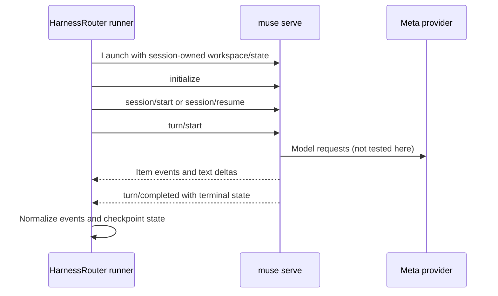
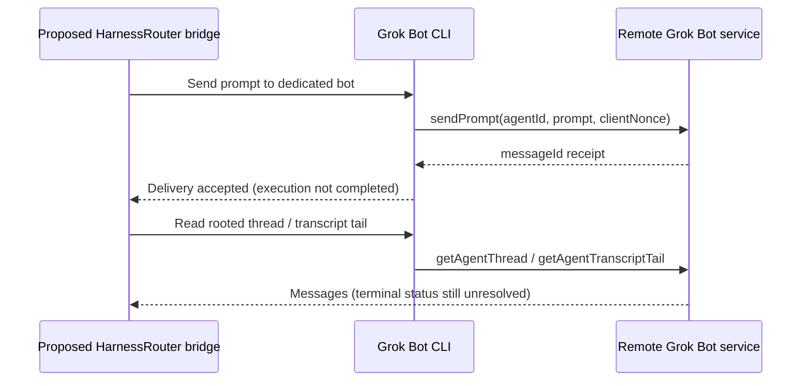

# Muse Code and Grok Bot: integration investigation

Status: proposal, not backend support. Neither backend is registered or advertised by this change.
Investigated on 2026-09-20 against HarnessRouter commit
`db93ee495d2d5e275db4dda1c72c2efe1b244563`.

These names mean **Meta Muse Code** and **Grok Bot via ScriptedAlchemy/grok-bot-cli**.
Grok coding CLIs and using Grok or Muse models through an existing backend are separate subjects.

## Findings

| Requirement | Muse Code 1.3.0-R3401.1 | Grok Bot CLI at b1c7471 |
| --- | --- | --- |
| Start work | `exec --json` tested with offline echo provider | `sendPrompt` sends to a remote agent; source inspected only |
| Machine-readable output | JSONL records observed; MSP schema exported | JSON delivery receipt and thread snapshots |
| Completion | `run.terminal.completed` observed in echo; MSP declares `turn/completed` | No authoritative remote execution terminal identified in the inspected wrapper |
| Resume | MSP declares `session/resume`; not exercised | Reuse remote agent/thread; not equivalent to a checkpointed local workspace |
| Cancellation | MSP declares `turn/cancel`; not exercised | No remote task cancellation operation identified in the inspected wrapper |
| Runtime installation | Official manifest lists macOS, Linux and Windows binaries with SHA-256 checksums | Node CLI; desktop session or explicit gateway authentication |
| Workspace artifacts | Explicit workspace flag; real tool/file production untested | No workspace download/checkpoint operation identified in the inspected wrapper |
| Model routing | CLI declares `meta` and `echo`, model and base URL options; real routing untested | `sendPrompt` request has no model/provider selection field |

Absence from this wrapper is not a claim that the underlying Grok Bot service lacks the capability.
An offline echo success is not a real model, tools, auth, or conformance result.

## Muse: proposed local backend



Prefer evaluating MSP (`muse serve`) for the production adapter. Its exported stable schema
explicitly describes session lifecycle, model changes, item events, pending interactions and
turn cancellation. This resembles the existing Codex app-server integration but is a different
protocol: its request types and event semantics must be implemented independently.

The exported schema requires caller-supplied UUIDv7 `commandId` values for session start,
resume and turn start. `session/start.sessionId` creates a new session and rejects existing
identities; it is not a resume mechanism. Likewise, the presence of `exec --session-id` does
not establish headless resumption. The `resume` help describes an interactive session picker
or exact session selection, not an `exec resume` command.

The small offline probe in [scripts/probe-muse.py](../scripts/probe-muse.py) uses `exec` only to
verify JSONL framing and the parent run's terminal event. It does not implement an MSP client.
Observed JSONL records include:

- `run.lifecycle.started` with `payload.command_id` and `payload.run_stream.id`;
- `run.output.delta` with `payload.text`;
- `run.terminal.completed` with `payload.terminal`, `payload.text` and `payload.reason`.

Child `task.lifecycle.*` records also occur. A child task finishing or failing must not be
mistaken for the foreground run's terminal state. MSP `turn/completed` separately carries
`sessionId`, `turnId`, `terminal` and an error for failed turns. Unknown terminal values must
not become success by default.

### Reproduce the limited probe

Supply a separately obtained, checksum-verified Muse binary:

```bash
python3 scripts/probe-muse.py --binary /absolute/path/to/muse
python3 -m unittest discover -s scripts/tests -p 'test_probe_muse.py'
```

The probe requests the local `echo` provider, disables session logging and foreign personal
context, retains default approval/sandbox settings, and uses a temporary workspace. It neither
supplies provider credentials nor runs a real model task. Muse may still inspect its own user
configuration or attempt to materialize bundled files; this is not a home-directory isolation
mechanism. Run in a disposable OS user/container for strict isolation.

The investigation's macOS ARM64 binary matched SHA-256
`20c5eb32f6aea741adac032c14be2f1897432caaf35144c33279a4d2b0bd8840`.
Its stable schema export fingerprint was
`sha256:7469c9e352e67def4a59df7e439984d7194fa351e1c8b7abb34060fd977ced81`.
The manifest lists Linux x86 and ARM64 artifacts, but neither was executed here.
The macOS probe completed with the expected echo response; startup also reported sandbox-denied
bundled-skill materialization, so this does not establish that bundled skills work.

### Work required before registration

1. Verify license/distribution terms, pin the runtime and checksums, and test the Linux installer.
2. Establish per-session state and credential locations. Keep secrets out of checkpoints and
   prevent one session from reading another's credentials or personal configuration.
3. Implement the MSP driver and normalization, including timeouts, EOF without terminal,
   authentication/provider errors, usage, tool events, and pending user/approval requests.
4. Exercise real model selection, authenticated first turn, follow-up, model switch, artifact
   production and resume after workspace recycle. Schema declarations alone are insufficient.
5. Verify instruction files, skills, MCP setup and actual tool denial. The schema admits
   `session/start.config.mcpServers`; its presence does not prove an end-to-end MCP call.
6. Complete every runner, gateway, console, installation and measurement registration in
   [Adding a harness](harness-verification.md#adding-a-harness).

Do not advertise arbitrary OpenAI-compatible routing: `--base-url` alone does not establish
protocol compatibility. Do not use `--no-session-log` for the eventual durable backend.

## Grok Bot: remote lifecycle gap



The inspected wrapper has three authentication paths: explicit gateway URL/token, the desktop
app's encrypted session, or a Cursor access token used to obtain a sandbox gateway. These are
not interchangeable with an xAI model API key. This investigation did not read credentials or
send messages to a live bot.

`sendPrompt` returns `accepted` only when a `messageId` is present. Ambiguous transmission is
`unknown`; retrying blindly can duplicate work. The CLI can return exit code zero alongside
unknown delivery, so process exit alone is not an execution-success signal.

`thread --root` can scope reads to a root message. `thread --after` instead filters a bounded
tail locally; a missing cursor returns a snapshot with `gapReset: true`. It is not durable
event replay. A bridge must handle gaps and deduplication and prove request/reply correlation.
Neither a quiet polling interval nor the first bot reply establishes task completion.

No remote stop, authoritative per-run terminal, selected/served model, or local workspace
transfer contract was identified in these entry points. Killing `gbot` cannot be used as proof
of remote cancellation. Its Codex bridge's completion/cancellation logic concerns Codex and
must not be attributed to Grok execution.

Skills in this wrapper are account-wide. Mapping HarnessRouter's per-harness skill uploads
directly to `gbot skills add` would change other bots' behavior. A dedicated-bot/thread policy
alone does not solve that shared skill scope.

Recommended next step: establish a documented remote execution contract (correlation,
completion, cancellation, failures, isolation, artifacts and model identity) before registering
Grok Bot as a base harness. A separately scoped messaging tool is another possible integration,
but it must not claim the lifecycle guarantees of a local HarnessRouter backend.

## Evidence

- [Official Muse product and installer](https://dev.meta.ai/)
- [Official launcher](https://api.meta.ai/muse-launcher.sh) and
  [pinned release manifest](https://lookaside.facebook.com/lookaside/muse/download/?channel=muse&version=1.3.0-R3401.1&file=manifest.json)
- Help and `schema generate-json-schema` output from the checksum-verified Muse binary
- [Grok gateway implementation](https://github.com/ScriptedAlchemy/grok-bot-cli/blob/b1c747132799707b0733bbdb9f0179c721c0f0c8/src/core/gateway.js)
- [Grok send receipt](https://github.com/ScriptedAlchemy/grok-bot-cli/blob/b1c747132799707b0733bbdb9f0179c721c0f0c8/src/cli/send.tsx)
- [Grok thread reads](https://github.com/ScriptedAlchemy/grok-bot-cli/blob/b1c747132799707b0733bbdb9f0179c721c0f0c8/src/cli/thread.tsx)
- [Grok cursor semantics](https://github.com/ScriptedAlchemy/grok-bot-cli/blob/b1c747132799707b0733bbdb9f0179c721c0f0c8/src/core/transcript.js)

This proposal intentionally leaves the production catalog and support matrix unchanged until
the required measurements exist. It is an investigation for maintainer discussion under the
repository's contribution process, not a claim of implemented or verified backend support.
